<div align="center">

# ⚖️ LegalPro — Legal Intake Management System

**A full-stack legal case management platform built with Spring Boot & React**

[](https://www.java.com/)
[](https://spring.io/projects/spring-boot)
[](https://reactjs.org/)
[](https://www.mysql.com/)
[](https://razorpay.com/)
[](https://www.twilio.com/)

[Features](#-features) • [Screenshots](#-screenshots) • [Architecture](#-architecture) • [Getting Started](#-getting-started) • [API Overview](#-api-overview) • [Roles](#-user-roles) • [Deployment](#-deployment)

</div>

---

## 📌 Overview

**LegalPro** is a comprehensive legal intake and case management system designed to streamline the workflow between clients, lawyers, and admins. It handles everything from Google OAuth login and role-based access, to case tracking, document management, WhatsApp notifications, Razorpay payments, calendar scheduling, and a full audit trail.

---

## ✨ Features

### 🔐 Authentication & Authorization
- **Google OAuth 2.0** — one-click login, no registration needed
- **Role selection** after first login: `Lawyer` or `Client`
- **Admin approval flow** — accounts wait for admin activation
- **JWT-based** stateless session management
- Protected routes per role on both frontend and backend

### 📁 Case Management
- Create, view, update, and close legal cases
- Assign cases to specific lawyers
- Track case status: `Open → In Progress → Closed`
- Upload and manage case-related documents
- Document access controls enforced per role

### 👥 Team Management
- Admin dashboard to view all registered users
- Approve or reject pending lawyer/client accounts
- Full team overview with role and status information

### 📅 Calendar & Scheduling
- Schedule hearings, consultations, and appointments
- Calendar view for lawyers and clients
- Event management tied to specific cases

### 🗂️ Audit Log
- Tracks every significant action in the system
- Records: user actions, case changes, login events, approvals
- Admin-accessible full audit trail for accountability

### 💬 WhatsApp Notifications (Twilio)
- Auto WhatsApp message when a **new case is created**
- Auto WhatsApp message when **case status is updated**
- Powered by **Twilio WhatsApp Sandbox API**

### 💳 Razorpay Payment Integration
- Clients can pay for legal services directly in the app
- Razorpay checkout popup embedded in the frontend
- Backend handles order creation and payment verification

### 🤖 AI Legal Assistant
- AI-powered chat assistant for legal queries
- Helps clients understand their situation and options
- Available within the case detail view

### 📊 Reports & Analytics
- Visual dashboard with live case statistics
- Case status breakdown charts
- Lawyer-wise and date-wise case trends

### 🔔 In-App Notifications
- Real-time notification system for case updates
- Team activity and approval alerts

---

## 📸 Screenshots

### 🔑 Login
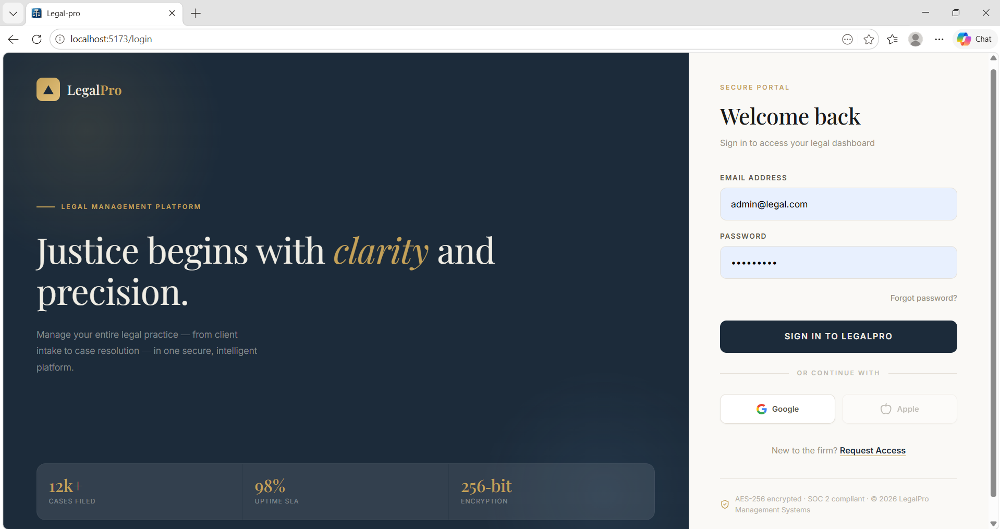

### 🎭 Select Role
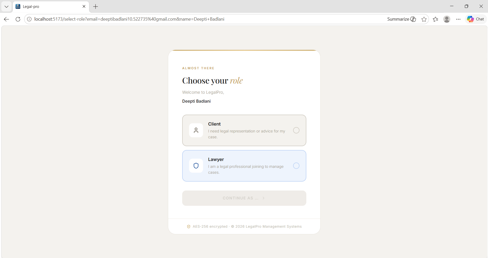

### ⏳ Pending Approval
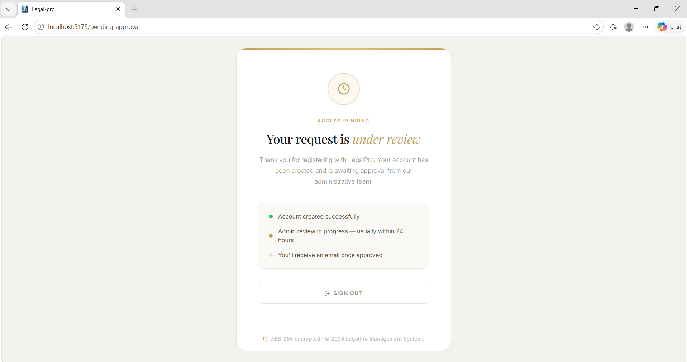

### 🏠 Dashboard
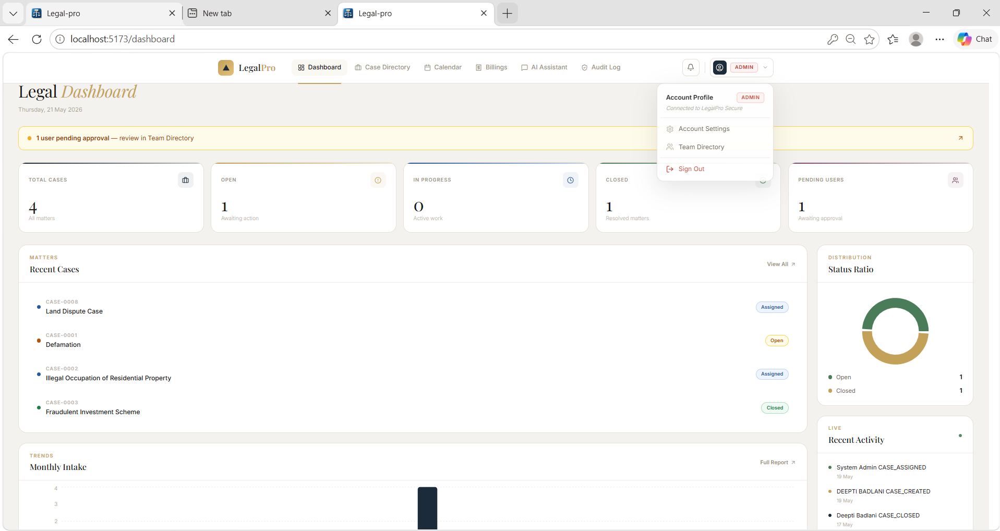

### 📁 Cases
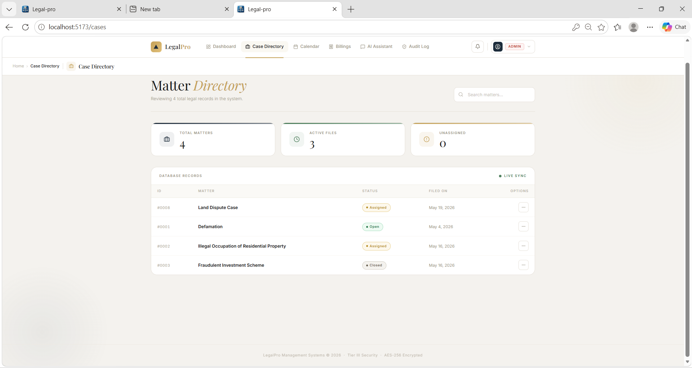

### ➕ Create Case
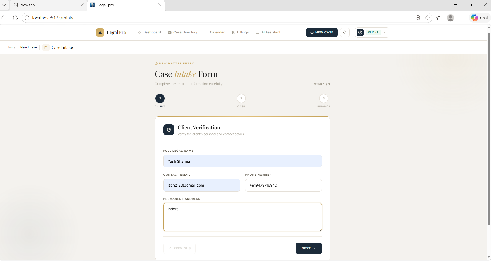

### 📄 Document Controls
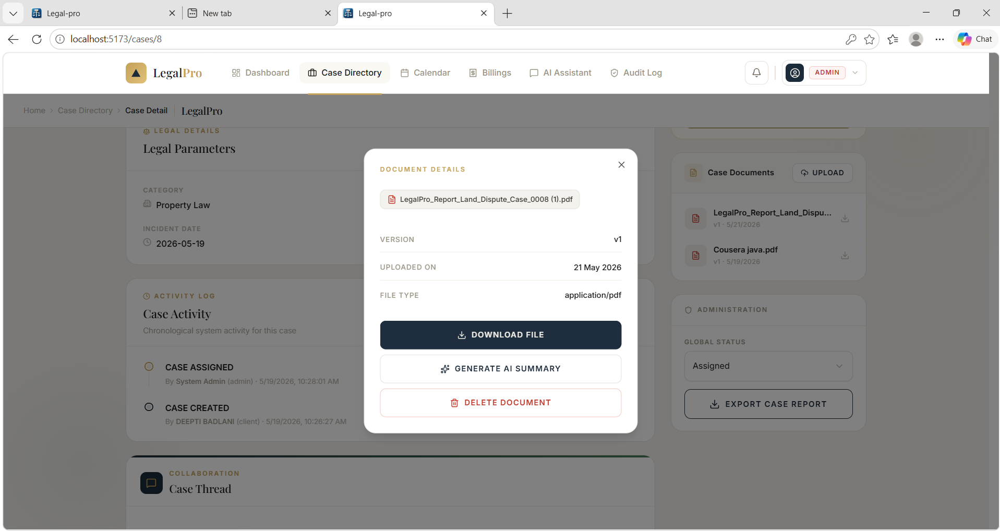

### 📤 Upload Document
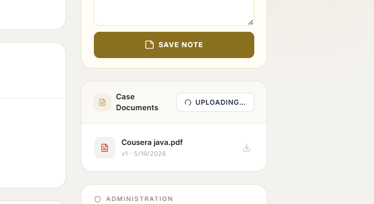

### 👥 Team Management
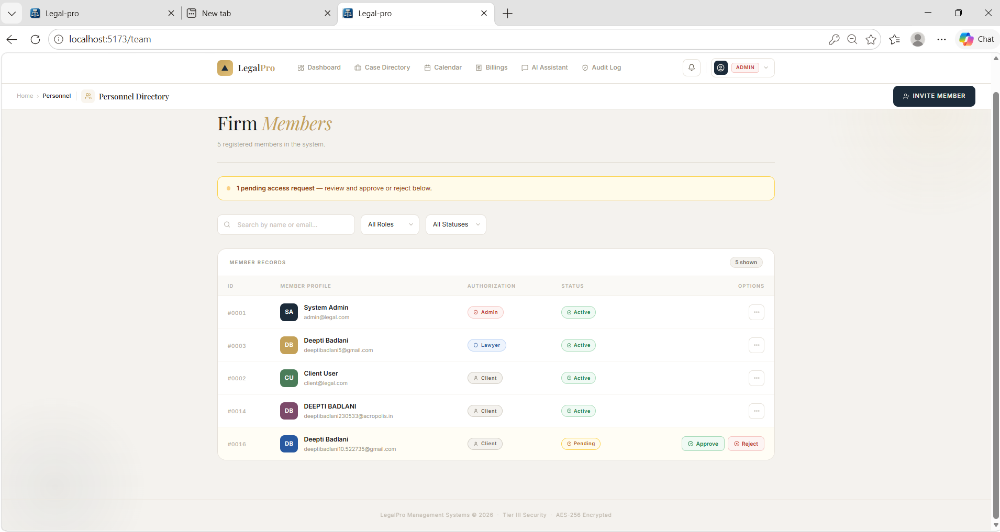

### 📅 Calendar
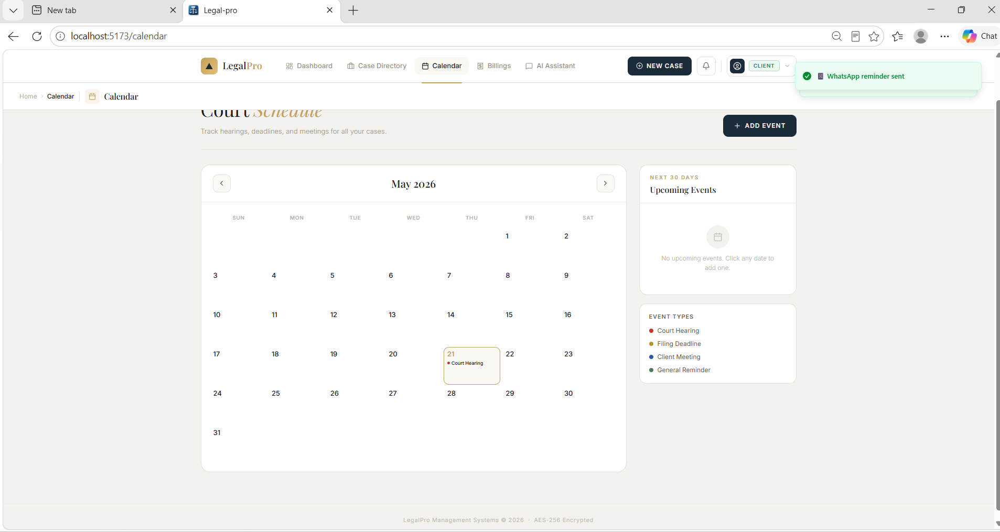

### 🗂️ Audit Log
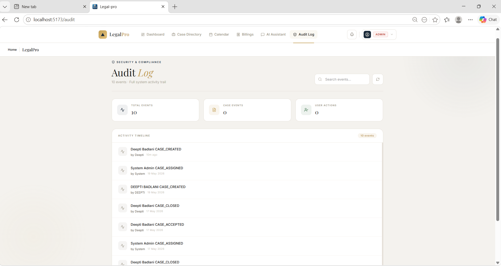

### 📊 Reports
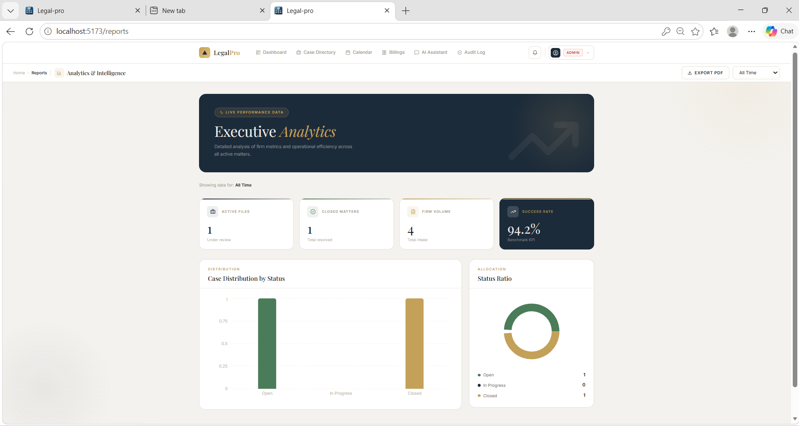

### 💳 Razorpay Payment
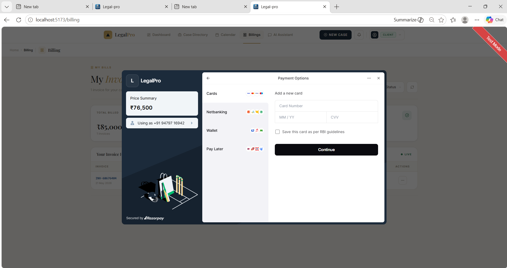

### 💬 WhatsApp Notification
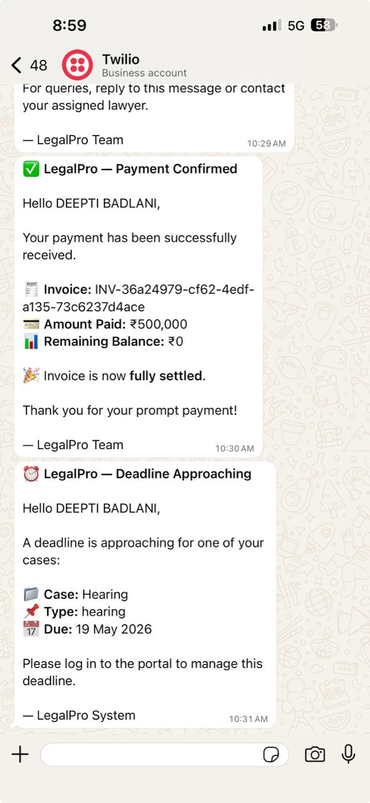

### 🔔 Notifications
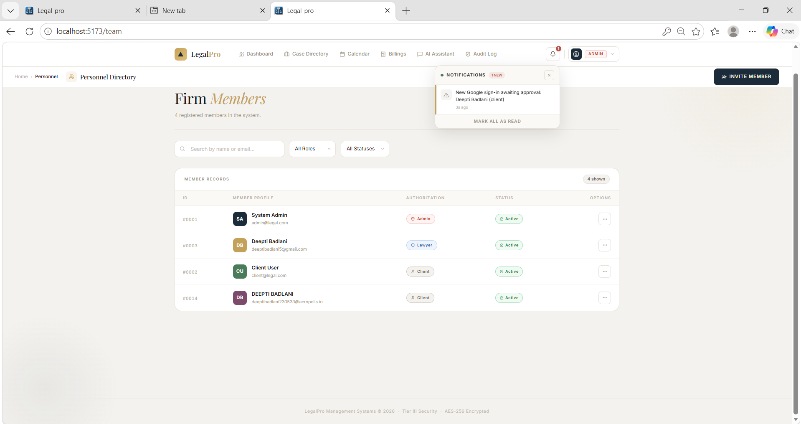

### 🤖 AI Assistant
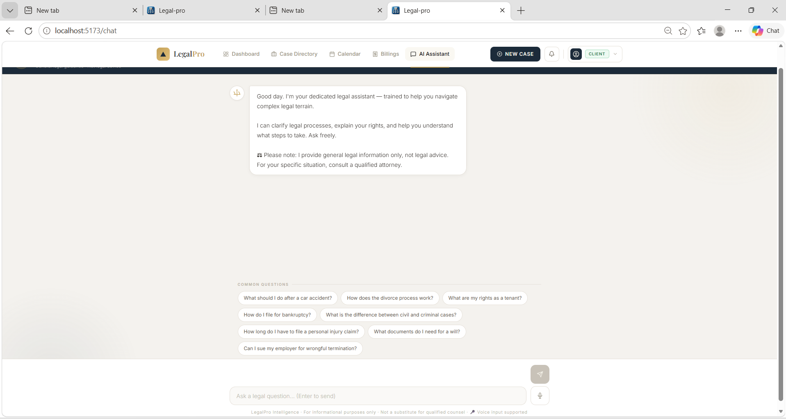

---

## 🏗️ Architecture

```
┌─────────────────────────────────────────────────────────────┐
│                        CLIENT LAYER                         │
│                  React.js + Tailwind CSS                    │
│   Login │ Dashboard │ Cases │ Calendar │ Reports │ Admin    │
└──────────────────────────┬──────────────────────────────────┘
                           │ HTTP / REST API
                           ▼
┌─────────────────────────────────────────────────────────────┐
│                      BACKEND LAYER                          │
│                  Spring Boot 3 (Java 17)                    │
│                                                             │
│  ┌─────────────┐  ┌──────────────┐  ┌───────────────────┐  │
│  │  Controllers │  │   Services   │  │   Repositories    │  │
│  │  (REST APIs) │→ │ (Biz Logic)  │→ │   (JPA/MySQL)     │  │
│  └─────────────┘  └──────────────┘  └───────────────────┘  │
│                                                             │
│  ┌──────────────────────────────────────────────────────┐   │
│  │               Spring Security + JWT                  │   │
│  │         Google OAuth 2.0 Authentication              │   │
│  └──────────────────────────────────────────────────────┘   │
└──────────┬──────────────┬──────────────────┬────────────────┘
           │              │                  │
           ▼              ▼                  ▼
    ┌────────────┐  ┌──────────────┐  ┌────────────────┐
    │   MySQL    │  │    Twilio    │  │   Razorpay     │
    │  Database  │  │  (WhatsApp)  │  │   (Payments)   │
    └────────────┘  └──────────────┘  └────────────────┘
```

### Folder Structure

```
legalpro-springboot/
├── src/main/java/com/legalintake/
│   ├── controller/          # REST API endpoints
│   ├── service/             # Business logic layer
│   ├── repository/          # JPA data repositories
│   ├── model/               # Entity classes (User, Case, etc.)
│   ├── config/              # Security, OAuth, CORS config
│   ├── dto/                 # Request/Response DTOs
│   └── util/                # JWT utils, helpers
├── src/main/resources/
│   └── application.properties
├── frontend/
│   ├── src/
│   │   ├── pages/           # Route-level page components
│   │   ├── components/      # Reusable UI components
│   │   ├── context/         # Auth & global state
│   │   └── services/        # Axios API call functions
│   └── package.json
├── screenshots/
├── pom.xml
└── README.md
```

---

## 🚀 Getting Started

### Prerequisites

- [Java 17+](https://adoptium.net/)
- [Node.js 18+](https://nodejs.org/)
- [MySQL 8.0+](https://www.mysql.com/)
- [Maven 3.8+](https://maven.apache.org/)

### 1. Clone the Repository

```bash
git clone https://github.com/deeptibadlani230533/legalpro-springboot.git
cd legalpro-springboot
```

### 2. Set Up the Database

```sql
CREATE DATABASE legalintake;
```

### 3. Configure Backend

Edit `src/main/resources/application.properties`:

```properties
# Database
spring.datasource.url=jdbc:mysql://localhost:3306/legalintake
spring.datasource.username=YOUR_DB_USER
spring.datasource.password=YOUR_DB_PASSWORD
spring.jpa.hibernate.ddl-auto=update

# Google OAuth
spring.security.oauth2.client.registration.google.client-id=YOUR_GOOGLE_CLIENT_ID
spring.security.oauth2.client.registration.google.client-secret=YOUR_GOOGLE_CLIENT_SECRET

# JWT
jwt.secret=YOUR_JWT_SECRET_KEY
jwt.expiration=86400000

# Twilio (WhatsApp)
twilio.account.sid=YOUR_TWILIO_ACCOUNT_SID
twilio.auth.token=YOUR_TWILIO_AUTH_TOKEN
twilio.whatsapp.from=whatsapp:+14155238886

# Razorpay
razorpay.key.id=YOUR_RAZORPAY_KEY_ID
razorpay.key.secret=YOUR_RAZORPAY_KEY_SECRET
```

### 4. Run the Backend

```bash
mvn spring-boot:run
```

Backend runs on: `http://localhost:8080`

### 5. Run the Frontend

```bash
cd frontend
npm install
npm start
```

Frontend runs on: `http://localhost:3000`

---

## 📡 API Overview

| Method | Endpoint | Description |
|--------|----------|-------------|
| `GET` | `/api/auth/google` | Google OAuth login |
| `POST` | `/api/auth/select-role` | Set role after first login |
| `GET` | `/api/cases` | Get all cases |
| `POST` | `/api/cases` | Create a new case |
| `PUT` | `/api/cases/{id}/status` | Update case status |
| `GET` | `/api/users` | Get all users (Admin) |
| `PUT` | `/api/users/{id}/approve` | Approve a user (Admin) |
| `GET` | `/api/calendar` | Get scheduled events |
| `POST` | `/api/calendar` | Create calendar event |
| `GET` | `/api/audit-log` | Get full audit trail (Admin) |
| `POST` | `/api/payment/order` | Create Razorpay order |
| `POST` | `/api/payment/verify` | Verify payment signature |
| `GET` | `/api/reports` | Get analytics data |

---

## 👤 User Roles

| Role | Access |
|------|--------|
| **Admin** | Approve/reject users, full case access, audit log, reports, team management |
| **Lawyer** | View assigned cases, update status, upload documents, calendar, notifications |
| **Client** | Create cases, view own cases, make payments, AI assistant, calendar |

---

## 🌐 Deployment

> Currently running locally.
> Planned deployment: **Railway** (Spring Boot backend) + **Vercel** (React frontend)

---

## 👩‍💻 Author

**Deepti Badlani**  
[](https://github.com/deeptibadlani230533)

---

## 📄 License

This project is built for educational and portfolio purposes.
